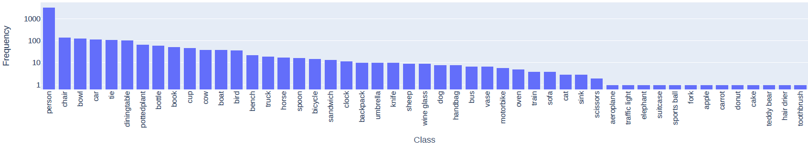

# ÖWF Object Detection Dataset (ÖMF-OD)
ÖWF-OD is a dataset for object detection in archival film content. The dataset enables
the evaluation of detection methods for image data with very different image qualities.
1,000 selected keyframes from 100 hours of video material have been annotated. 
4,480 objects in the images have been labeled with one or more of the 80 object
categories defined by the MS-COCO dataset.

#### Dataset Link
<!-- info: Provide a link to the dataset: -->
<!-- width: half -->
https://github.com/TailoredMediaProject/OEWF_ObjectDetection

#### Data Card Author(s)
<!-- info: Select **one role per** Data Card Author:

(Usage Note: Select the most appropriate choice to describe the author's role
in creating the Data Card.) -->
<!-- width: half -->
- **Helmut Neuschmied** (Contributor)
- **Werner Bailer** (Contributor)
- **Georg Thallinger** (Contributor)
- **Gabriele Fröschl** (Owner)
## Authorship
### Publishers
#### Publishing Organization(s)
<!-- scope: telescope -->
<!-- info: Provide the names of the institution or organization responsible
for publishing the dataset: -->
JOANNEUM RESEARCH Forschungsgesellschaft mbH

Video data hosted and curated by Österreichische Mediathek

#### Industry Type(s)
<!-- scope: periscope -->
<!-- info: Select **all applicable** industry types to which the publishing
organizations belong: -->
- Not-for-profit - Tech

#### Contact Detail(s)
<!-- scope: microscope -->
<!-- info: Provide publisher contact details: -->
- **Publishing POC:** Werner Bailer
- **Affiliation:** JOANNEUM RESEARCH Forschungsgesellschaft mbH
- **Contact:** Steyrergasse 17, 8010 Graz, Austria, <werner.bailer@joanneum.at>
- **Website:** https://github.com/TailoredMediaProject/OEWF_ObjectDetection

### Funding Sources
#### Institution(s)
<!-- scope: telescope -->
<!-- info: Provide the names of the funding institution(s): -->
- Austrian Research Promotion Agency (FFG)
- Horizon 2020: EU's research and innovation funding programme

#### Funding or Grant Summary(ies)
<!-- scope: periscope -->
<!-- width: full -->
<!-- info: Provide a short summary of programs or projects that may have funded
the creation, collection, or curation of the dataset.

Use additional notes to capture any other relevant information or
considerations. -->
This work has been partially supported by the Austrian Research Promotion Agency (FFG) under the project TailoredMedia (ICT for the Future) and by the EU's Horizon 2020 research and innovation programme under the grant agreement no 951911, AI4Media - A European Excellence Centre for Media, Society and Democracy.


## Dataset Overview
#### Data Subject(s)
<!-- scope: telescope -->
<!-- info: Select ***all applicable**** subjects contained the dataset: -->
- Sensitive Data about people
- Data about places and objects

#### Dataset Snapshot
<!-- scope: periscope -->
<!-- info: Provide a snapshot of the dataset:<br><br>(Use the additional notes
to include relevant information, considerations, and links to table(s) with
more detailed breakdowns.) -->
Category | Data
--- | ---
Size of Dataset | 84 MB
Number of Instances | 1,000
Labeled Classes | 49
Number of Labels | 4,480

**Above:** Basic properties of the ÖWF-OD datast.


#### Content Description
<!-- scope: microscope -->
<!-- info: Provide a short description of the content in a data point: -->

The images of the dataset are extracted from 446 videos, or about 100 hours
of footage, from the online access of the Österreichische Mediathek. 
The collection consists of scientific films which are similarly divided 
into black/white and colour films. They are about traditions, cultural assets,
handicrafts and documentaries about travel and educational films from
mainly national but also international productions. There are quite
salient differences in terms of quality of the image data between
the different films.


#### Descriptive Statistics
<!-- width: full -->
<!-- info: Provide basic descriptive statistics for each field.

Use additional notes to capture any other relevant information or
considerations.

Usage Note: Some statistics will be relevant for numeric data, for not for
strings. -->



**Above:** Distribution of classes in the dataset.


### Sensitivity of Data
#### Sensitivity Type(s)
<!-- scope: telescope -->
<!-- info: Select ***all applicable*** data types present in the dataset: -->
- S/PII
- Others: media recorded for educational purposes

#### Field(s) with Sensitive Data
<!-- scope: periscope -->
<!-- info: List fields in the dataset that contain S/PII, and specify if their
collection was intentional or unintentional.

Use additional notes to capture any other relevant information or
considerations. -->
**Intentional Collected Sensitive Data**

Some recordings contain people performing arts and crafts of cultural ceremonies, which are the purpose of the recordings.

**Unintentionally Collected Sensitive Data**

Bystanders/people in public spaces are recorded in some intances.


#### Security and Privacy Handling
<!-- scope: microscope -->
<!-- info: Summarize the measures or steps to handle sensitive data in this
dataset.

Use additional notes to capture any other relevant information or
considerations. -->

The data has been released for public screening for educational and scientific purposes for decades. The content used here has also been cleared to be made available on the web.

#### Risk Type(s)
<!-- scope: telescope -->
<!-- info: Select **all applicable** risk types presenting from the
dataset: -->
- No Known Risks

#### Risk(s) and Mitigation(s)
<!-- scope: microscope -->
<!-- info: Summarize the steps taken to identify and mitigate risks from PII
or sensitive information.

Use additional notes to capture any other relevant information or
considerations. -->
Summarize here. Include links and metrics where applicable.

The recordings show arts and culture performed with the knowledge that recordings are taken. There is no known risk from the use of the content in the dataset.

### Dataset Version and Maintenance
#### Maintenance Status
<!-- scope: telescope -->
<!-- info: Select **one:** -->

**Actively Maintained** - Adding annotations, making corrections and fixing technical issues.

#### Version Details
<!-- scope: periscope -->
<!-- info: Provide details about **this** version of the dataset: -->
**Current Version:** 1.0

**Last Updated:** 04/2023

**Release Date:** 04/2023

#### Maintenance Plan
<!-- scope: microscope -->
<!-- info: Summarize the maintenance plan for the dataset:


**Versioning:** All changes are tracked by te repositories' versioning mechanism. This may include versions due to added annotations or corrections of errors.


#### Next Planned Update(s)
<!-- scope: periscope -->
<!-- info: Provide details about the next planned update: -->
**Version affected:** 1.0

**Next data update:** n/a

**Next version:** 1.1

**Next version update:** not scheduled yet


## Example of Data Points
#### Primary Data Modality
<!-- scope: telescope -->
<!-- info: Select **one**: -->
- Image Data
- Text Data

See ```annotation.json``` for annotation samples. 

Extracted keyframe samples are included in this paper (to be added).


## Motivations & Intentions
### Motivations
#### Purpose(s)
<!-- scope: telescope -->
<!-- info: Select **one**: -->
- Research
- Others: assessing performance of technologies/products for archival content

#### Domain(s) of Application
<!-- scope: periscope -->
<!-- info: Provide a list of key domains of application that the dataset has
been designed for:<br><br>(Usage Note: Use comma-separated keywords.) -->

`Object Detection`, `Machine Learning`, `Computer Vision`

#### Motivating Factor(s)
<!-- scope: microscope -->
<!-- info: List the primary motivations for creating or curating this dataset:

(Usage Note: use this to describe the problem space and corresponding
motivations for the dataset.) -->
For example:

- Bringing diversity to imagery training data for object-detection models
- Encouraging academics to take on second-order challenges of cultural representation in object detection

The dataset can be used to benchmark existing object
detection algorithms and to develop new algorithms specifically
tailored for archival film content.

### Intended Use
#### Dataset Use(s)
<!-- scope: telescope -->
<!-- info: Select **one**: -->
- Safe for research use

#### Suitable Use Case(s)
<!-- scope: periscope -->
<!-- info: Summarize known suitable and intended use cases of this dataset.

Use additional notes to capture any specific patterns that readers should
look out for, or other relevant information or considerations. -->
**Suitable Use Case:** Testing of object detection algorithms.

**Suitable Use Case:** Fine-tuning of object detection algorithms.


#### Unsuitable Use Case(s)
<!-- scope: microscope -->
<!-- info: Summarize known unsuitable and unintended use cases of this dataset.

Use additional notes to capture any specific patterns that readers should look
out for, or other relevant information or considerations. -->
**Unsuitable Use Case:** Training object detection algorithms from scratch.


#### Research and Problem Space(s)
<!-- scope: periscope -->
<!-- info: Provide a description of the specific problem space that this
dataset intends to address. -->
Assessing performance of object detectors on historic visual content.

#### Citation Guidelines
<!-- scope: microscope -->
<!-- info: Provide guidelines and steps for citing this dataset in research
and/or production.

Use additional notes to capture any specific patterns that readers should look
out for, or other relevant information or considerations. -->
**Guidelines & Steps:** Summarize here. Include links where necessary.

**BiBTeX:**
```
@inproceedings{neuschmied2023,
  title={\"OWF-OD: A Dataset for Object Detection in Archival Film Content},
  author={Neuschmied, Helmut and Thallinger, Georg and Bailer, Werner and F\"oschl Gabriele},
  booktitle={International Conference on Content-based Multimedia Indexing},
  year={2023},
  note={under review}
}
```


## Access, Rentention, & Wipeout
### Access
#### Access Type
<!-- scope: telescope -->
<!-- info: Select **one**: -->
- External - Open Access

#### Documentation Link(s)
<!-- scope: periscope -->
<!-- info: Provide links that describe documentation to access this
dataset: -->
- GitHub https://github.com/TailoredMediaProject/OEWF_ObjectDetection

### Retention
#### Duration
<!-- scope: periscope -->
<!-- info: Specify the duration for which this dataset can be retained: -->
n/a


### Wipeout and Deletion
#### Duration
<!-- scope: periscope -->
<!-- info: Specify the duration after which this dataset should be deleted or
wiped out: -->
n/a


## Provenance
### Collection
#### Method(s) Used
<!-- scope: telescope -->
<!-- info: Select **all applicable** methods used to collect data: -->
- Taken from other existing datasets

#### Methodology Detail(s)
<!-- scope: periscope -->
<!-- info: Provide a description of each collection method used.

**Collection Type**

Curated collection of scientific/educational film material

**Source:** Made available and maintained by Austrian Mediathek: https://www.mediathek.at/oesterreich-am-wort/sammlungen/sammlung/collection/23/?global[collectionhistory]=35

**Platform:** Austrian Mediathek's web catalogue: https://www.mediathek.at/

**Is this source considered sensitive or high-risk?** No

**Dates of Collection:** film collection created 1962-1997

**Primary modality of collection data:**


- Film/Video Data

**Update Frequency for collected data:**

*Usage Note: Select one for this collection type.*

- Static


#### Collection Cadence
<!-- scope: telescope -->
<!-- info: Select **all applicable**: -->
**Static:** Data was collected once from a single source (ÖWF, Austrian Institute for Scientific Film)


#### Data Integration
<!-- scope: periscope -->
<!-- info: List all fields collected from different sources, and specify if
they were included or excluded from the dataset.

Use additional notes to
capture any other relevant information or considerations.

(Usage Note: Duplicate and complete the following for each upstream
source.) -->
**Source** Annotation added during creation of this dataset.


#### Data Processing
<!-- scope: microscope -->
<!-- info: Summarize how data from different sources or methods aggregated,
processed, or connected.

Use additional notes to capture any other
relevant information or considerations.

(Usage Note: Duplicate and complete the following for each source OR
collection method.) -->
**Collection Method or Source**

**Description:** Keyframe extraction (as performed by the provided code).

**Methods employed:** Visual quality analysis has been performed, the relevant resulting metadata are provided. 

**Tools or libraries:** [VidiCert](https://www.vidicert.com/)


### Collection Criteria
#### Data Selection
<!-- scope: telescope -->
<!-- info: Summarize the data selection criteria.

Use additional notes to capture any other relevant information or
considerations. -->
- **Collection Method of Source:** All digitised film from the collection that are published on the web catalogue have been included.


#### Data Exclusion
<!-- scope: microscope -->
<!-- info: Summarize the data exclusion criteria.

Use additional notes to capture any other relevant information or
considerations. -->
- **Collection Method of Source:** After manual inspection, keyframes showing black frames, titles, transitions, unidentifiable content or similar have been excluded. The provided script allows to reproduce these exclusions.


### Relationship to Source
#### Use & Utility(ies)
<!-- scope: telescope -->
<!-- info: Describe how the resulting dataset is aligned with the purposes,
motivations, or intended use of the upstream source(s).

Use additional notes to capture any other relevant information or
considerations.

(Usage Note: Duplicate and complete the following for each source type.) -->
- **Source Type:** The dataset contributes to developing methods for finding and using cultural heritage collections.


## Human and Other Sensitive Attributes
#### Sensitive Human Attribute(s)
<!-- scope: telescope -->
<!-- info: Select **all attributes** that are represented (directly or
indirectly) in the dataset. -->
- Images of persons or their faces

#### Intentionality
<!-- scope: periscope -->
<!-- info: List fields in the dataset that contain human attributes, and
specify if their collection was intentional or unintentional.

Use additional notes to capture any other relevant information or
considerations. -->
**Intentionally Collected Attributes**

If the person is participating in the action (craft, cultural tradition etc.) that is in the focus of the film.

**Unintentionally Collected Attributes**

If the person is a viewer, bystander etc.


## Extended Use
### Use with Other Data
#### Safety Level
<!-- scope: telescope -->
<!-- info: Select **one**: -->
- Safe to use with other data


#### Known Safe Dataset(s) or Data Type(s)
<!-- scope: periscope -->
<!-- info: List the known datasets or data types and corresponding
transformations that **are safe to join or aggregate** this dataset with. -->
**Dataset or Data Type:** Other object detectin datasets, e.g. MS COCO.


#### Known Unsafe Dataset(s) or Data Type(s)
<!-- scope: periscope -->
<!-- info: Fill this out if you selected "Conditionally safe to use with other
datasets" or "Should not be used with other datasets":

No datsets known.


### Forking & Sampling
#### Safety Level
<!-- scope: telescope -->
<!-- info: Select **one**: -->
- Conditionally safe to fork and/or sample


#### Acceptable Sampling Method(s)
<!-- scope: periscope -->
<!-- info: Select **all applicable** acceptable methods to sample this
dataset: -->
- Stratified Sampling

Sampling a subset to balance object classes may be beneficial. Further sampling is likely to result in too few instances per class.


#### Limitation(s) and Recommendation(s)
<!-- scope: microscope -->
<!-- info: Fill this out if you selected "Conditionally safe to fork and/or
sample" or "Should not be forked and/or sample":

Summarize the limitations that the dataset introduces when forking
or sampling the dataset and corresponding recommendations.

Use additional notes to capture any other relevant information or
considerations. -->

The apprach of referring to the source videos on the website rather than redistributing extracted keyframes shall be kept.


### Use in ML or AI Systems
#### Dataset Use(s)
<!-- scope: telescope -->
<!-- info: Select **all applicable** -->
- Testing
- Validation
- Fine Tuning


#### Comparative Summary
<!-- scope: microscope -->
<!-- info: Why were missing values cleaned using
this method (over others)? Provide
comparative charts showing before
and after missing values were cleaned. -->

Link to paper to be added.


## Annotations & Labeling
<!-- info: Fill this section if any human or algorithmic annotation tasks were
performed in the creation of your dataset. -->
#### Annotation Workforce Type
<!-- scope: telescope -->
<!-- info: Select **all applicable** annotation
workforce types or methods used
to annotate the dataset: -->
- Machine-Generated
- Human Annotations (Employees)


#### Annotation Characteristic(s)
<!-- scope: periscope -->
<!-- info: Describe relevant characteristics of annotations
as indicated. For quality metrics, consider
including accuracy, consensus accuracy, IRR,
XRR at the appropriate granularity (e.g. across
dataset, by annotator, by annotation, etc.).

Use additional notes to capture any other
relevant information or considerations.

(Usage Note: Duplicate and complete the
following for each annotation type.) -->
**Annotation Type** | **Number**
--- | ---
Total number of annotations | 4,480


#### Annotation Description(s)
<!-- scope: microscope -->
<!-- info: Provide descriptions of the annotations
applied to the dataset. Include links
and indicate platforms, tools or libraries
used wherever possible.

Use additional notes to capture any
other relevant information or
considerations.

(Usage Note: Duplicate and complete
the following for each annotation
type.) -->
**(Annotation Type)**

**Description:** Annotations (bounding boxes) for 49 of the COCO80 classes are provided. For the annotation task we use the Computer Vision Annotation Tool (CVAT). In order to facilitate the annotation process, automatic annotation was carried out in a first step with the help of the YOLOv7 object detector. Afterwards, the annotation data was manually reviewed, corrected and extended. Each frame has been manually checked by at least two persons. 

**Link:** http://github.com/opencv/cvat/.

**Platforms, tools, or libraries:**

- Computer Vision Annotation Tool (CVAT)


**Additional Notes:** Add here

#### Annotation Distribution(s)
<!-- scope: periscope -->
<!-- info: Provide a distribution of annotations for each
annotation or class of annotations using the
format below.

Use additional notes to capture any other
relevant information or considerations.

(Usage Note: Duplicate and complete the
following for each annotation type.) -->
**Annotation Type** | **Number**
--- | ---
person | 3299
chair | 143
bowl | 131
car | 116
tie | 109
diningtable | 104
pottedplant | 67
bottle |  	62
book | 53
cup | 47
cow | 39
boat  |	38
bird | 37
bench | 22
truck | 19
horse | 18
spoon | 17
bicycle | 15
sandwich | 14
clock | 12
backpack | 10
umbrella | 10
knife | 10
sheep | 9
wine glass | 9
dog | 8
handbag | 8
bus | 7
vase | 7
motorbike | 6
oven | 5
train | 4
sofa | 4
cat | 3
sink | 3
scissors | 2
aeroplane | 1
traffic light | 1
elephant | 1
suitcase | 1
sports ball | 1
fork | 1
apple | 1
carrot | 1
donut | 1
cake | 1
teddy bear | 1
hair drier | 1
toothbrush | 1


**Above:** Distribution of classes in the dataset.


#### Annotation Task(s)
<!-- scope: microscope -->
<!-- info: Summarize each task type associated
with annotations in the dataset.

Use additional notes to capture any
other relevant information or
considerations.

(Usage Note: Duplicate and complete
the following for each task type.) -->
**(Task Type)**

**Task description:** Review, correct and add object bounding boxes and related class labels.


### Human Annotators
<!-- info: Fill this section if human annotators were used. -->
#### Annotator Description(s)
<!-- scope: periscope -->
<!-- info: Provide a brief description for each annotator
pool performing the human annotation task.

Use additional notes to capture any other
relevant information or considerations.

(Usage Note: Duplicate and complete the
following for each annotation type.) -->
**(Annotation Type)**

**Number of unique annotators:** 3

**Expertise of annotators:** Computer vision experts


**Annotation platforms:** CVAT

