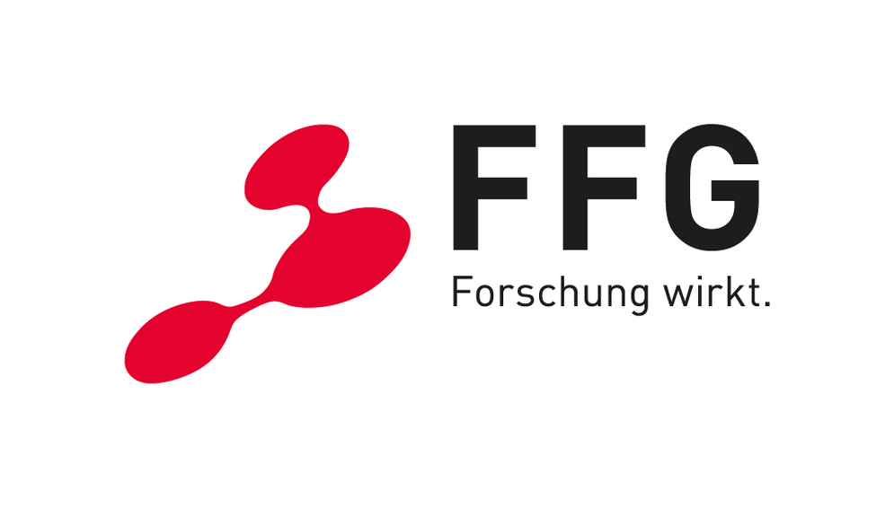

# OEWF_ObjectDetection

This dataset contains object detection annotations and quality metadata of historic film with scientific and educational content. The content is from the collection ["Österreichische Bundesinstitut für den Wissenschaftlichen Film (ÖWF)"](https://www.mediathek.at/wissenschaft-als-film/die-sammlung-des-oewf/) of the [Austrian Mediathek](https://www.mediathek.at).

## Organisation of the dataset

The repository does not contain content, but provides links to content on the content provider's website, and scripts to extract and select keyframes in a reproducible way.

The set of keyframes is describes in ``keyframe_metadata.csv''. The columns in this file have the following semantics:

| Column | Description |
| ----------- | ----------- |
| video | ID of the video. |
| url | Video download URL. |
| frame | Frame number in the video. | 
| color | Color or black/white. |
| framerate | Frame rate of the video. |
| descr_timeunit | Description time unit (typically the same as the frame rate). |
| width | Frame width in pixels. |
| height | Frame height in pixels. |
| aspect_ratio | Frame aspect ratio. |
| activity | Visual activity measurement. |
| luminance_range | Luminance range measurement. |
| blurriness | Bluriness measurement. |
| noise | Image noise/grain measurement. |

## License

The code in this repository is provided under MIT License. Note that for the content, the source license applies.

## Acknowledgement

The research leading to these results has been funded partially by the program ICT of the Future by the Austrian Federal Ministry of Climate Action, Environment, Energy, Mobility, Innovation and Technology (BMK) in the project [TailoredMedia](https://www.joanneum.at/en/digital/reference-projects/tailoredmedia), and from the European Union's Horizon 2020 research and innovation programme, under grant agreement no. 951911 [AI4Media](https://ai4media.eu). 

